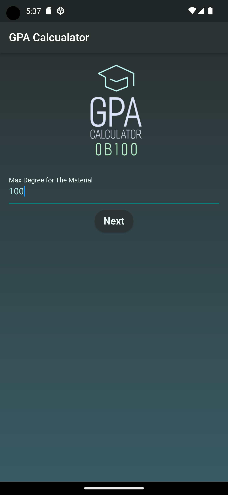
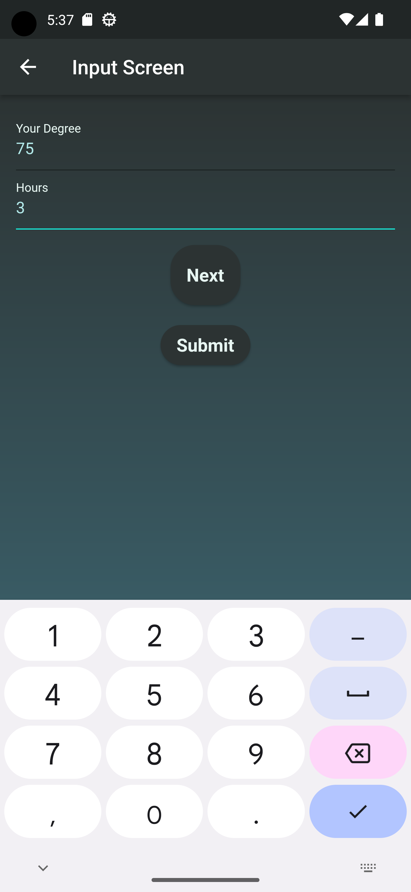
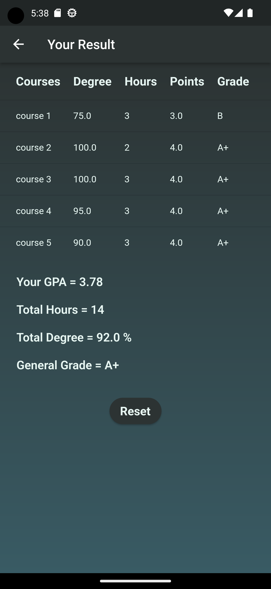

# GPA Calculator App

## Description

The GPA Calculator App is a simple and user-friendly mobile application built using the Flutter framework. It allows students to calculate their Grade Point Average (GPA) easily based on their course grades and credit hours. Whether you're in high school or college, this app provides a handy tool to keep track of your academic performance.

## Features

- Calculate GPA for individual courses.
- Support for both letter grades and numerical grades.
- Flexible credit hours input.
- Easy-to-use interface for adding and managing courses.
- Accurate GPA calculation based on your input.

## Installation

1. Make sure you have [Flutter](https://flutter.dev/) installed on your machine.
2. Clone this repository: `git clone https://github.com/yourusername/gpa-calculator-app.git`
3. Navigate to the project directory: `cd gpa-calculator-app`
4. Install dependencies: `flutter pub get`
5. Run the app: `flutter run`

## Usage

1. Open the GPA Calculator App on your device.
2. Tap the "+" button to add a new course.
3. Enter the course name.
4. Choose the grade you've received (you can use either letters or numbers).
5. Enter the credit hours of the course.
6. Tap "Calculate" to view your GPA.

## Screenshots

## Contributing

Contributions are welcome! If you find any issues or want to enhance the app with new features, feel free to submit a pull request.

